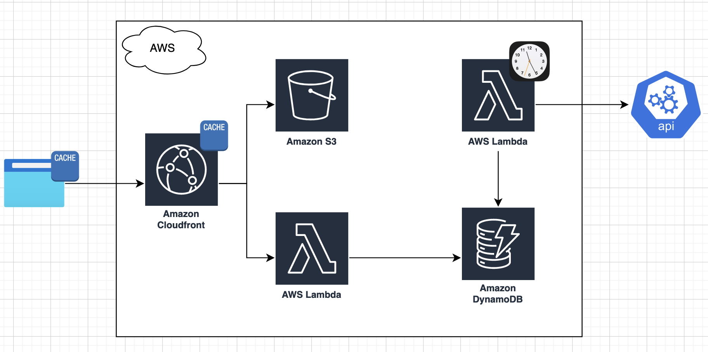
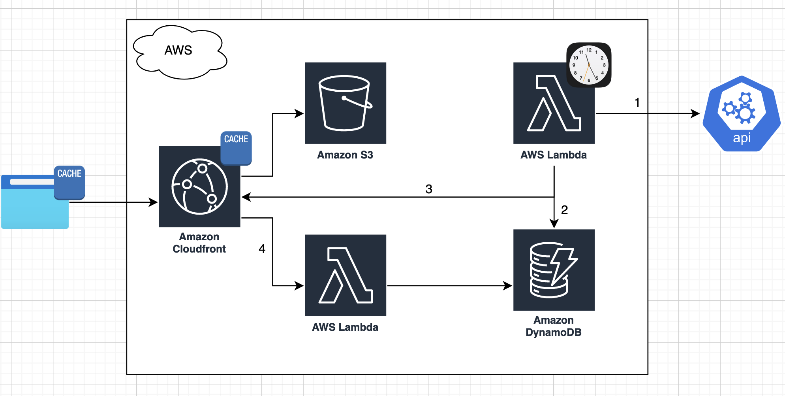

# What is it?

A serverless website hosted on AWS that helps you calculate and understand Amazon offer.

**Main features:**

* Calculate Amazon total compensation over a 4 years period
* RSU price-per-unit is calculated by Amazon's Simple Moving Average of 30 days
* You can select the Simple Moving Average of 30 days (SMA-30) of 8 latest consecutive Fridays
* You can provide the stock's year-over-year growth percentage

# Amazon total compensation formula

| Year | Formula                                                                   |
|------|---------------------------------------------------------------------------|
| 1    | Base + Sign-on Bonus Year 1 + (5% RSU priced at SMA-30)                   |
| 2    | Base + Sign-on Bonus Year 2 + (15% RSU priced with YOY Growth Percentage) |
| 3    | Base + (40% RSU priced with YOY Growth Percentage)                        |
| 4    | Base + (40% RSU priced with YOY Growth Percentage)                        |                                                                      |

# How often does the database get updated?

Every Friday, after stock market is closed (4:01pm EST).

This is the data model that represents the stock history data.

```
{
   "ticker": "AMZN"
   "closingDate": "2022-05-26",
   "sma30": "2654.8991",
   "expiration": 123456789 
}
```

# System design 1: store SMA-30 on DynamoDB

(Selected version)

* Store static website on S3
* Store SMA-30 values in DynamoDB with TTL of 60 days
* Cron-job Lambda will update DynamoDB with the latest SMA-30 on every Friday, and act as a rate limiter to the external
  API
* CloudFront will invoke Lambda@Edge to collect the SMA-30 data, and cache it for 5 minutes

## Components diagram



# System design 2: use Next.js on-demand re-validation feature

* Cron-job Lambda will re-validate the cache on CloudFront with the latest SMA-30s on every Friday, and act as a rate
  limiter to the external API
    * It does this by making an API request to Next.js, which will trigger another API request to the API Lambda to
      retrieve the new data
    * This approach will further reduce the traffic to our API Lambda to only a few times a week on Friday (because
      there could be more than 1 CloudFront Edge).
* **Unfortunately**, Serverless-Stack currently doesn't support Next.js on-demand re-validation on CloudFront yet

## Components diagram



# Tech stack

|                                  | Description                             |
|----------------------------------|-----------------------------------------|
| Next.js                          | Front-end framework for React           |
| Mantine                          | UI library that works with Next.js      |
| Serverless Stack Framework (SST) | IaC framework on top of AWS CDK         |
| Alpha Vantage stock API          | SMA30 API (subscribed through RapidAPI) |
| RapidAPI                         | API subscription platform               |

# Setup

1. Install SST and AWS CLI: https://docs.serverless-stack.com/installation
2. Create ".env.local" file under root to store external API
   secrets: https://docs.serverless-stack.com/environment-variables

```
X_RAPID_API_HOST=...
X_RAPID_API_KEY=... 
DB_ACCESS_KEY_ID=...
DB_SECRET_ACCESS_KEY=...
```

3. Install npm packages for each system component

```
tc-calculator-app: npm install
tc-calculator-app/frontend: npm install
tc-calculator-app/backend: npm install
```

# Development

There are 2 stages: dev and prod

    // Build CDK
    npm run build

    // Start Live Lambda Development + SST console. Run the Cron-job via the SST console.
    npx sst start

    // Run frontend website locally
    frontend: npm run dev

    // Connect SST console to prod stage
    npx sst console --stage prod

    // Deploy to prod stack. Deploy the dev stack to test the frontend component.
    npx sst deploy --stage prod

    // Remove stack
    npx sst remove --stage prod

# Testing

**Frontend**

1. Could be tested locally by mocking the API response inside /frontend/pages/api/sma30.ts
2. Run: /frontend: npm run dev

**Backend**

1. Run: npx sst start
2. The Cron-job that updates the database could be run via the SST console

# Operational

The Cron-job could be run on prod stack via the SST console. This could be helpful to add a SMA-30 record manually.

1. Connect SST console to prod stack: npx sst console --stage prod
2. Hard code a target date to update SMA-30: /backend/functions/dailyCon.ts

# References

* https://nextjs.org/learn/foundations/how-nextjs-works/rendering
* https://mantine.dev
* https://docs.serverless-stack.com
* https://rapidapi.com